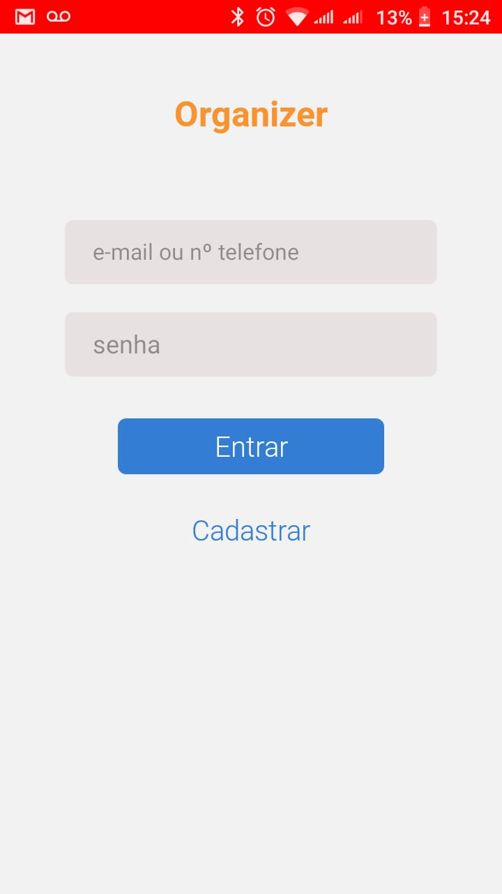

# Organizer - APP

## DESCRIÇÃO

Um app que ajuda na organização de contas a pagar e/ou contas a receber. Quando se insere a data de pagamento/recebimento de alguma conta e em quantas parcelas vai ser realizado, o APP vai calcular os valores de cada parcela e a data de pagamento/recebimento, e vai emitir uma notificação quando o dia de pagar/receber chegar. 

> Status do Projeto: Em desenvolvimento :warning:

## LAYOUT

